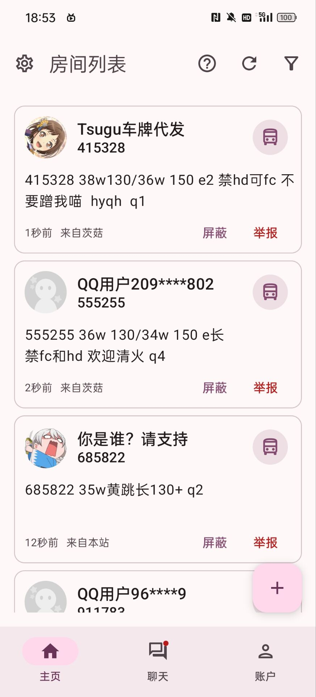
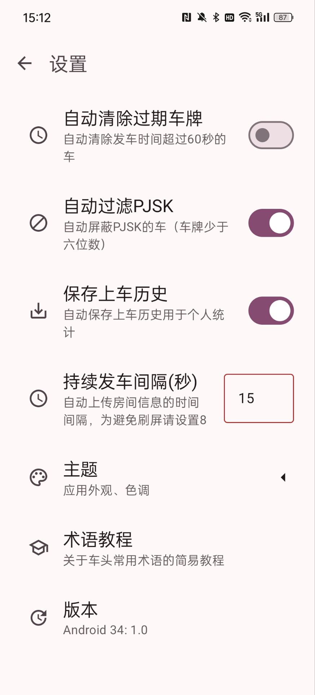

# BandoriStation Mobile

## What's This App?
This is a Multiplatform client app targeting Android, iOS, Desktop, designed for [BandoriStation](https://github.com/maborosh/BandoriStation), the room number data collection platform of *Band Dream! Girls Band Party!* mobile game. Bandori Station only supports browser, which is oftentimes inconvenient for players to use, when they're in the mobile game participating activities. Therefore, this project is inspired.

*BandoriStation Mobile* is based on **Compose Multiplatform**, with a MVI clean architecture, conforming to Material3 design style. It shares the same server with [BandoriStation](https://github.com/maborosh/BandoriStation).

[Chinese Video Introduction](https://www.bilibili.com/video/BV1rjNzzkEWT/?share_source=copy_web&vd_source=24de01f99fa9ffa018cdcaea27980a1e) is available.

## Features

- Same experience as the [website of BandoriStation](bandoristation.com).
- Multiplatofrm support.
- Responsive & Dynamic & Material3 expressive theme.
- Auto reconnection after being disconnected.
- Room history and data analysis.
- Room number encryption support.
- Group chat support.
- More personalized & extended features.

## Previews

  
  
  
  
  
  

## Credits

[BandoriStation](https://github.com/maborosh/BandoriStation) for providing such a brilliant platform for players to find teammates and communicate.

Contributions are welcome!
